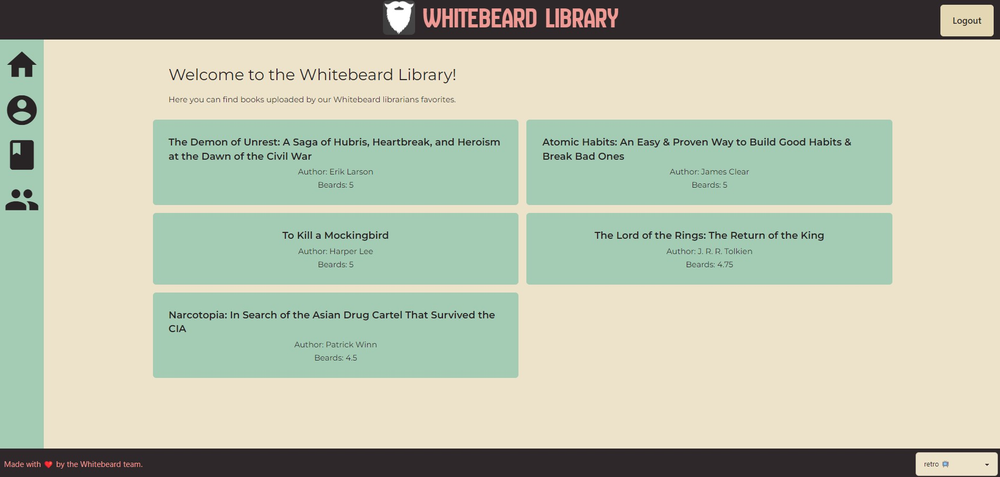

# Whitebeard Library
Project 3 - Whitebeard Team.

## Description
Website that allows users to view book ratings and reviews and add some of his/her own.

## Motivation
Provide book readers with a platform to rate and review books and allow them to find the best reads, while working with MongoDB (NoSQL), in a MERN schema and integrating a new style frame.

## What did we learn?
- To have a good database design: collections and field types, as well as in the definition of “models”.
- To take care of the integrity and congruence of the definitions: models, schemas (resolvers and type definitions), mutations and queries.
- To achieve a proper integration of components and pages in the application flow for the correct rendering of information.
- To understand the importance of integrating a good style to offer the user a good browsing experience within the application.

## Links
- Deployed website: https://special-octo-meme.onrender.com/
- GitHub repository: https://github.com/el-bicho7/special-octo-meme  

## User Story
AS a book lover
I WANT to view book ratings and reviews
SO THAT I can choose my next read
AND rate books myself
AND ALSO add my reviews for other users to see.

## Credits
Special thanks to our instructor, Chris Stallcup and our TA Brittani Court, for the support provided for the generation of this website.

## License
MIT License used for the corresponding repository.

## Screenshots

Whitebeard Library Homepage

Whitebeard User Review

Whitebeard User Profile

Whitebeard Library Bookshelf

